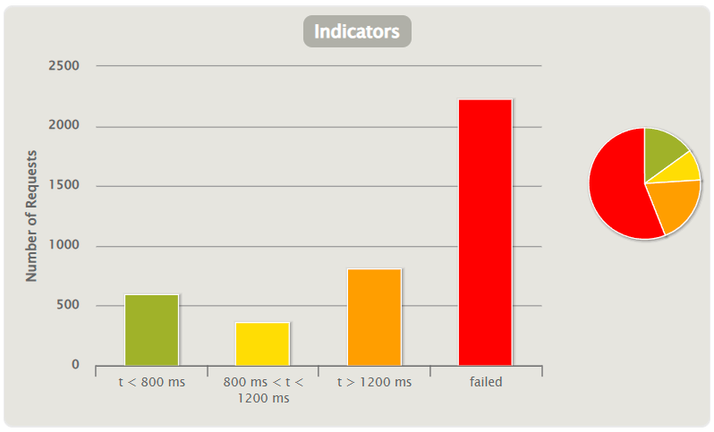

# WebPOS不同场景性能测试报告

The demo shows a web POS system , which replaces the in-memory product db in aw03 with a one backed by 京东.

## 前言
本次作业分布进行了几组对照实验，分别是有无缓存和在docker环境下通过扩展实例的方式在HAProxy均衡调度器的调度下的横向扩展不同实例个数的性能表现。

进行压力测试的工具使用的是gatling,测试的动作为访问一次/index主页，和进行三次添加操作。

## 缓存测试
本次作业使用的是redis作为缓存服务器和session服务器，运行在docker容器之中。分别对JD products列表及其搜索结果进行缓存。由于不使用缓存的情况下，会对JD的网站进行频繁爬取，导致出现反爬虫机制，所以只进行了一组对照实验。

### 无缓存情况

上图为无缓存情况，可以观察到有中体的延迟较大，且有较多fail。

### 使用缓存

上图为使用缓存的情况，可以观察到延迟极大的得到改善，且不存在fail的情况，并且从理论的分析，该情况不存调度器转发开销，应该为理论最优情况。

## 横向拓展测试
横向拓展采用的是docker限制cpus的方式，每个实例占用一个1cpu。做了四组实验，分别是在1个实例，3个实例和6个实例的情况。

### 单实例

### 三实例

### 六实例

### 九实例

### 横向扩展结论
随着实例的增多，失败率开始下载，但是由这是在一个伪分布情况下的实验，所以增长速度并非线性。且到9之后，本地cpu占用率已达到100%。

## 总结
横向扩展和cache都能够显著的增加服务器瞬时吞吐量。
